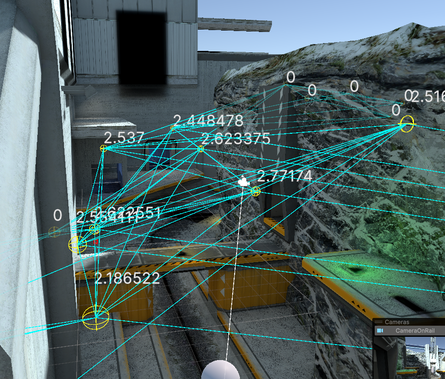
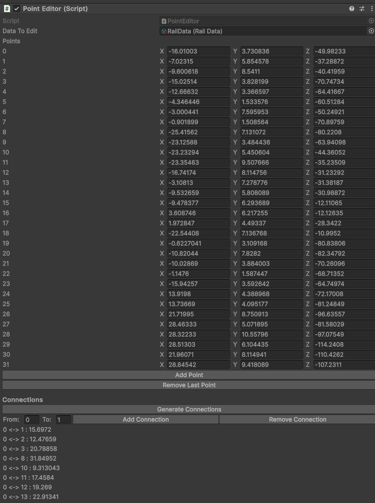

# Cinematographer VR

## introduction

This is a project to make a automatic cinematographer in a 3d computer game while for watching vr games.
Using Utility theory / score I find the best possible position for the camera and navigate it. towards the desired position.

## Motivation
I wanted to make this for a start to implement it in the game hyperdash. This is a faster pase first person shooter.
Where characters move quickly from place to place. Because of this you will only see the first person perspective of the players. Its to hard for human casters to keep up with the players so I want to make a Cinematographer that will capture cool moments form the third person.

# Result

The camera navigates the level trying to get a good angle on the player.

# how does it work?

First the user can create a set of points around the world make make connection between them to create a path.
The yellow points are nodes in the graph and the blue lines are connection between the different paths.

I made a custom unity editor script to display all the points and connections between the nodes.
- add and remove nodes
- Generate connections between the points. It sends raycasts to all other points and makes a connection if there is no object in the way.
- Add a manual connection between indexes of nodes.

Every point has a score. This score determines which is the best viewing angle for the camera right now.

The score is determined by these factors
- Can the point see the player?
- How close is the target
- Is it at a viewing angle of -15 degrees
- different angle difference between the camera and the points angle on the target.

# Future improvements

- Make the camera less agressive with moving.
- Don't go from point a to b also look between the points lines for good positions. 
- Use beziser curves to smooth out the curve so it doesn't go from 1 stop to another.
- Every point needs settings for what there optimal view angle and distance is.
- Look where the player is aiming and looking at guess that the action is going to take place. Add score to see if the points look that direction.
- Take multiple players into account.
- Instead of manual placing points use the navmesh to generate points.

# Conclusion
Its a start for creating a virtual Cinematographer. I learned how utility theory can be used not only for actions but also for points within a navmesh.

# Sources

- https://digitalcommons.dartmouth.edu/cgi/viewcontent.cgi?params=/context/masters_theses/article/1150/&path_info=Wu_Automated_Cinematographer_for_VR_Viewing_Experiences.pdf
- https://inria.hal.science/tel-01229590/file/main.pdf
- https://youtu.be/d63hbJYYqM8
